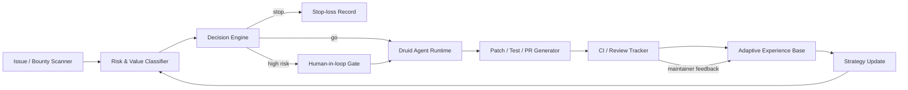

# Druid: Agentic Engineering OS

Low-touch agents for repo risk discovery, PR maintenance, and review-loop automation.

**Built by Yongshan Yu.**

Druid is an agentic engineering operating system for open-source PR work. It is proof that Yongshan can build internal agent frameworks that make AI coding tools operate reliably inside real repositories, CI systems, review loops, documentation, risk policies, and business goals.

The point is not that one Druid instance opened PRs. The point is that the framework can keep discovering, prioritizing, implementing, testing, reviewing, maintaining, and learning from engineering work with low ongoing supervision once the operating loop is built.

## Public Proof Snapshot

Last audited: **2026-06-11**.

| Signal | Evidence | Why it matters |
|---|---:|---|
| Merged PRs overall | 47 | Publicly merged work across RustChain and selected external repositories. |
| RustChain merged PRs | 45 | Public maintainer-reviewed outcomes in a real open-source codebase. |
| Full merged evidence board | 46 proof items | All RustChain merged PRs plus one selected external merged PR, grouped by technical surface. |
| Current RustChain review queue | 36 open PRs | Test-backed queue across payout, bridge, UTXO, governance, bounty, security, and reliability surfaces. |
| New weekly queue | 34 clean PRs opened on 2026-06-11 | Shows systematic risk-surface discovery and small reviewable PR slicing. |
| Outside RustChain merged proof | 1 selected merged PR | Shows the framework can transfer beyond one repo when the target has real review activity. |

Open PRs are review-queue evidence, not merge or reward claims.

## What Druid Demonstrates

| Capability | What the framework does |
|---|---|
| Issue and bounty discovery | Finds active review surfaces with reward/merge signals and avoids stale or low-return repos. |
| Risk classification | Prioritizes money-path, security, bridge, ledger, payout, governance, UTXO, and operational reliability risk. |
| PR generation | Produces bounded patches, regression tests, and review-ready PR bodies. |
| Review tracking | Follows CI, maintainer feedback, merge/close states, and maintenance cost. |
| Adaptive memory | Learns from merged, superseded, closed, stale, dirty, and rewarded work. |
| Stop-loss | Reduces maintenance on zombie PRs and stops work when evidence, reward, or review quality is weak. |
| Token budget discipline | Routes expensive reasoning to selection, patches, tests, and review replies while routine tracking runs through ledgers, CLI checks, and dedupe gates. |

## Architecture

## Site

This repository is designed to publish a GitHub Pages portfolio from `docs/`.

- Home: `docs/index.html`
- Druid case study: `docs/druid.html`
- Weekly command log: `docs/week.html`
- Evidence board: `docs/evidence.html`
- Token budget audit: `docs/token.html`
- Contact: `docs/contact.html`

## Links

- GitHub profile: [yyswhsccc](https://github.com/yyswhsccc)
- LinkedIn: [Yongshan Yu](https://www.linkedin.com/in/yongshan-yu-195771319/)
- Email: [yuyongshan573@gmail.com](mailto:yuyongshan573@gmail.com)
